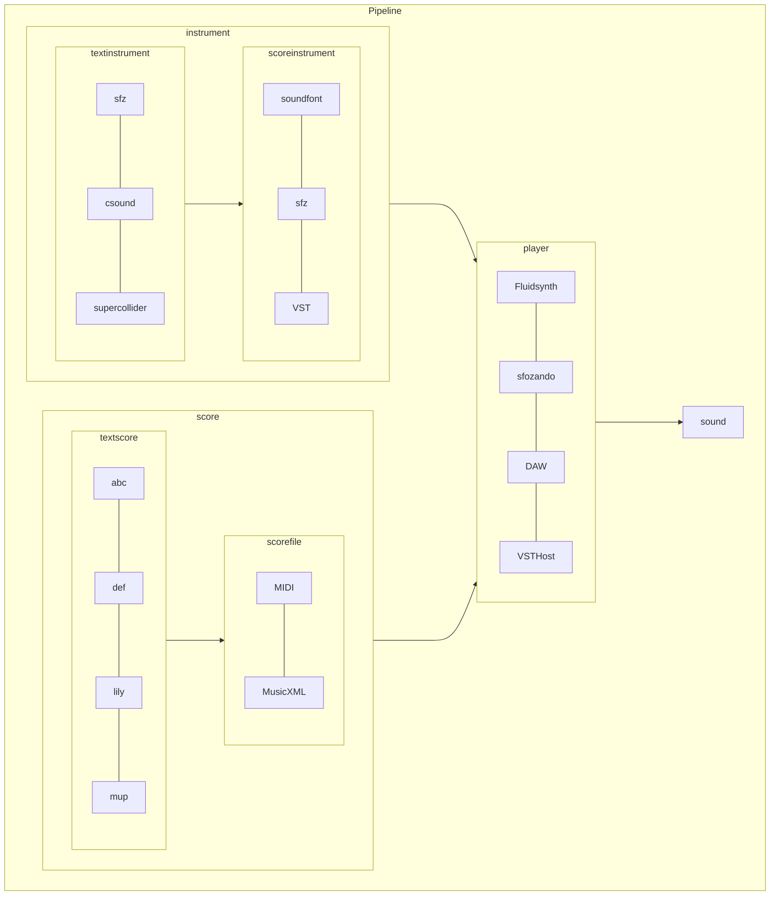

pitch features
time
velocity

```
language features
notes
chords
arpeggios
trills
tremolos
patterns
repeats
tracks
```

> [!IMPORTANT]
> sfdsfd
> Score + Instruments + Player = Sound


> [!IMPORTANT]
> Crucial information necessary for users to succeed.

## Instruments
| File Type | Instruments Text | Instrument Files |     Instrument Players |
| :-------- | :--------------- | :--------------: | ---------------------: |
| soundfont | n/a              |     sf2, sf3     |             Fluidsynth |
| sfz       | sfz              |       sfz        |              sforzando |
| VST       | csound, chuck    |       VST        | DAW, Kontakt, VST Host |


## Score
| File Type              | Score Text     | Score Files |
| :--------------------- | :------------- | :---------: |
| quantitative           | abc, def, lily |    MIDI     |
| semantic, qualitiative | abc, def, lily |  MusicXML   |


## Features
| File Type              | Score Text     | Score Files |
| :--------------------- | :------------- | :---------: |
| quantitative           | abc, def, lily |    MIDI     |
| semantic, qualitiative | abc, def, lily |  MusicXML   |



