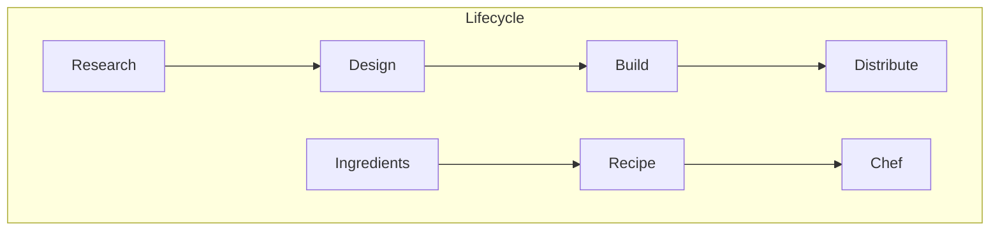
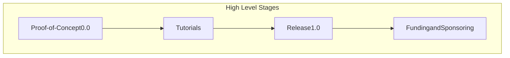
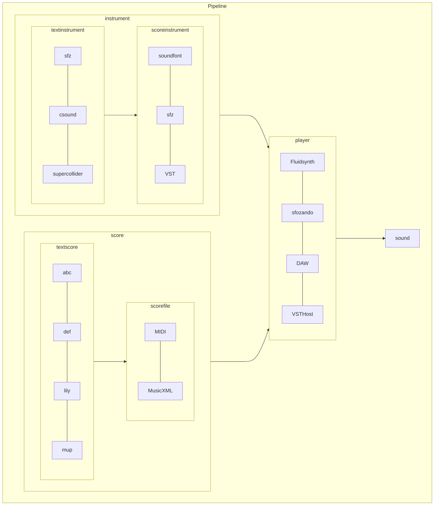

<pre class="mermaid">
flowchart TB

1[dfhdfg
dfghdf
ghdfhg
dfghdfh]

</pre>
<pre class="mermaid">
flowchart TD
     A-->B
</pre>

<b style="font-size=30px">bold</b>\
<i>italic</i>


pitch features
time
velocity

```
language features
notes
chords
arpeggios
trills
tremolos
patterns
repeats
tracks
```


<link rel="stylesheet" href="keyboard.css">
<script src="keyboard.js"></script>
<div id="keyboardInput"></div>
<script> 
document.getElementById("keyboardInput").innerHTML =  keyboard(`abcdefgrs`)
</script>


## Instruments

| File Type | Instruments Text | Instrument Files |     Instrument Players |
| :-------- | :--------------- | :--------------: | ---------------------: |
| soundfont | n/a              |     sf2, sf3     |             Fluidsynth |
| sfz       | sfz              |       sfz        |              sforzando |
| VST       | csound, chuck    |       VST        | DAW, Kontakt, VST Host |


## Score

| File Type              | Score Text     | Score Files |
| :--------------------- | :------------- | :---------: |
| quantitative           | abc, def, lily |    MIDI     |
| semantic, qualitiative | abc, def, lily |  MusicXML   |


## Features

| File Type              | Score Text     | Score Files |
| :--------------------- | :------------- | :---------: |
| quantitative           | abc, def, lily |    MIDI     |
| semantic, qualitiative | abc, def, lily |  MusicXML   |







<!-- <script type="module">
	import mermaid from 'https://cdn.jsdelivr.net/npm/mermaid@10/dist/mermaid.esm.min.mjs';
	mermaid.initialize({
		startOnLoad: true,
		theme: 'dark'
	});
</script> -->
